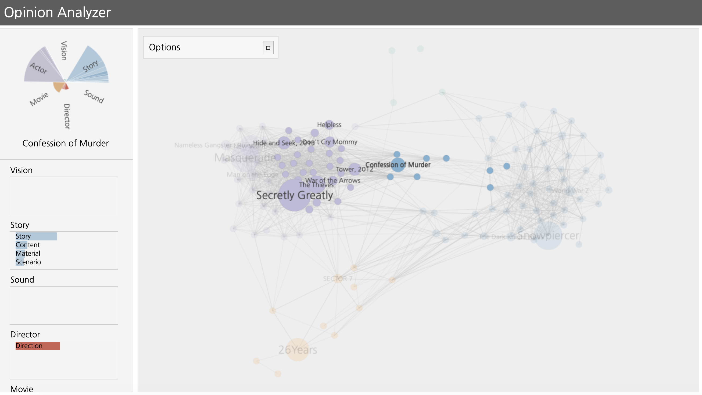

# OpinionAnalyzer

<!--      -->
    

## Abstract
The rapid development of the Web 2.0 era has generated a huge amount of online word-of-mouth information, which has influenced the society in various fields. Effects of Word of Mouth on movies, in particular, has become the new standards to evaluate a movie that affects potential audiences’ decision. Therefore, this research proposes a methodology to analyze the responses of movie audiences with the visualization.

### Screenshots
-----------

  </img>

- [Try to use OpinionAnalyzer](https://seongmin-mun.github.io/VisualSystem/Collaborator/OpinionAnalyzer/movies_pie.html)

### Skills
-------
Machine Learning & NLP

- Computer Languages: R, Python
- DataBase: MySQL
- Machine Learning: Correlation, Cosine similarity
- NLP-based methods: Ontology, TF-IDF, POS tagger, Pre-Processing (tokenization, lemmatization, N-gram, window size), etc.
- Statistics: Reliability Analysis, Independence t-test
- Tools: IntelliJ IDEA, RStudio

Visualization Technique

- Visualization Methods: Distribution Map, Polar Chart

Server (Back-end)

- Computer Languages: Java, Python, PHP
- DataBase: MySQL
- Libraries: Java (KKMA(org.snu.ids.ha), Eunjeon (org.bitbucket.eunjeon.seunjeon)), Python (numpy, sklearn, pandas, nltk)
- Tools: IntelliJ IDEA, PyCharm

Client (Front-end)

- Computer Languages: javascript (d3.js, jquery.js), html/css
- DataBase: json
- Tools: Atom

