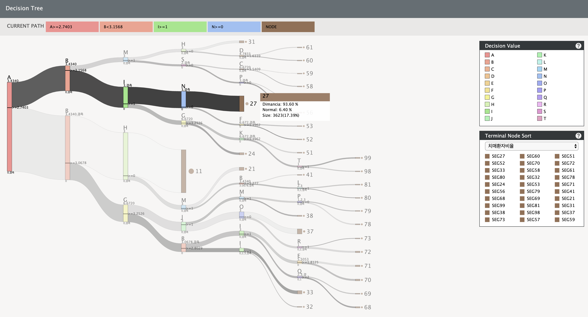

# SankeyTree

<!--      -->
    

## Abstract
A decision tree is one of the predictive models in data mining and has been widely used in recent medical-data analyses. In the finding of an important node, the existing decision-tree visualizations are used to show the ratio of the sample number to the target variable. Additional decisionvariable information, however, is needed since the decision tree for the analysis of the medical data is important for the identification of the variables. Therefore, this study proposes a visualization that can be used to easily find the important terminal nodes and grasp the decision variables.
### Screenshots
-----------

  </img>

- [Try to use SankeyTree](https://seongmin-mun.github.io/VisualSystem/Collaborator/SankeyTree/index.html)

### Skills
-------
 Machine Learning & Statistics

- Language : R, Python
- DataBase : MySQL
- Machine Learning : Decision Tree (CART (Classification And Regression Trees)), Logistic Regression
- Statistics : Decision Tree Anlaysis
- Tool : RStudio, PyCharm, Jupyter notebook

Visual Technique

- Visual Method : Sankey Diagram

Server (Back-end)

- Language : Python
- DataBase : MySQL, MongoDB
- Library : Python (numpy, pandas)
- Tool : PyCharm

Client (Front-end)

- Language : javascript (d3.js, jquery.js), html/css
- DataBase : json
- Tool : Atom, WebStorm

### Related works
-------
Paper

- S. Bae, <strong>S. Mun</strong>, G. Choi, S. Lim, S. Bang, S. Son, C. Hong, H. Shin, and K. Lee, Visualization based sankey diagram for decision making tree analysis, ACM, Computer Graphics International 2017 (CGI2017), Jun 2017, [PDF](https://seongmin-mun.github.io/MyWebsite/Seongmin/Resources/3.Conferences/Posters/CGI2017/Visualization%20of%20Decision%20Trees%20that%20Analyze%20Medical%20Data.pdf)

Video

- [Video](https://youtu.be/nE6q0tUcgNg)

