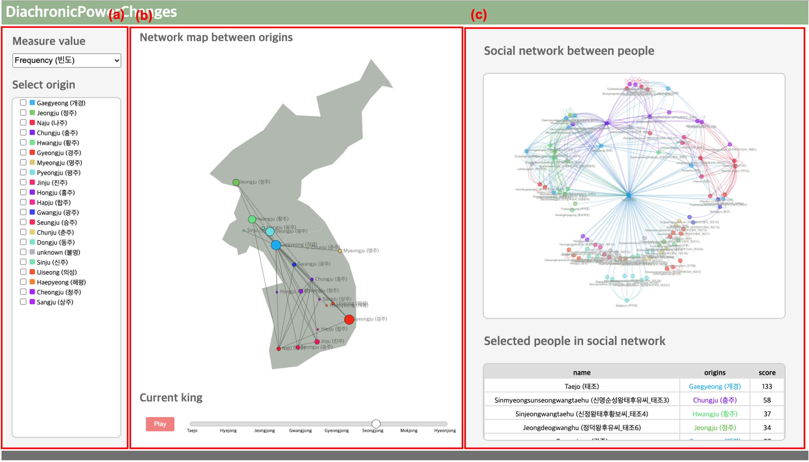

# DiachronicPowerChanges
<!--[](https://shields.io/#/) [](https://shields.io/#/) [](https://shields.io/#/) [](https://shields.io/#/) [](https://shields.io/#/) [](https://shields.io/#/) [](https://shields.io/#/)-->
[](https://shields.io/#/) [](https://shields.io/#/) [](https://shields.io/#/) [](https://shields.io/#/) [](https://shields.io/#/) [](https://shields.io/#/)

## Abstract
Political marriage has been a historically productive and important matter to maintain or extend social power. This kind of relationship is also found in Korean history. For instance, in the history of the Goryeo dynasty (i.e., AD 918~ 1392 in Korea), the royal families of the Goryeo dynasty used marriage as a political strategy to maintain or extend their power. Qualitative studies have found that royal families used marriage as a means of maintaining political power, but there is still a lack of quantitative research supporting the outcomes of these studies. For this reason, we adopt network analysis algorithms (i.e., degree centrality, closeness centrality, and betweenness centrality) to advance our understanding of the role of political marriage in the Goryeo dynasty, in Korea. In addition, to simulate the change of power by their origin, we made a visualization system to explore the marriage network of royal families. We note two major findings of this current study. First, the marriage strategies of royal families are divided into three types: (1) extra-family marriages, (2) inter-family marriages, and (3) the combination of extra-family marriages and inter-family marriages. The royal family of Goryeo expanded their external relationship through extra-family marriages and reproduced their power through intra-family marriages. Second, the power of the region is higher in the region where the king was produced through marriage than in the region where many marriages were made with the royal family. As a whole, the success of our computational approaches adds to the quantitative evidence for the historical strategies of political marriage in the Goryeo dynasty, in Korea. 

## Developing the visualization system
We designed a visualization system with JavaScript, HTML, and CSS environments, using the final data including the marriage relationships between people in the Goryeo dynasty, Korea. For the interface of the system, we created three areas for the exploration of the marriage network: data selection interface, network map between origins, and social network between people and details table of the people. As shown in (b), the network map presents the relationship between origins based on the selected measure values involving different origins (represented as dots and colors). A slider at the bottom of the map allows for changing the kings; the patterns of the network change as the slider moves. Each dot shows the details of the origin (e.g., an index/name of the selected origin, the score according to the selected measure value) once the mouse pointer is located on the dot. For the manipulation of visualization outcomes, (a) provides options to select the measure values and checkboxes to highlight interesting origins.  The right side of the system as in (c) provides users social network between people, and a details table of the people. This section is also interlocked with the data selection part so that highlights interesting people by the selected origins. The table at the bottom right side of the system presents the details of the people in the social network. This table provides several people's information such as name, origin, and score according to the selected origin and measure value.


### Screenshots
-----------
<div>
  <a target="_blank" rel="noopener noreferrer" href="https://seongmin-mun.github.io/VisualSystem/Major/DiachronicPowerChanges/index.html"></a>
</div>

- [Try to use DiachronicPowerChanges](https://seongmin-mun.github.io/VisualSystem/Major/DiachronicPowerChanges/index.html)

### Skills
-------
Machine Learning & NLP & Statistics

- Computer Languages: Java, R, Python
- DataBase: MySQL
- Machine Learning: Network analysis algorithms (i.e., degree centrality, closeness centrality, and betweenness centrality)
- Tools: IntelliJ IDEA, RStudio, PyCharm, bitnami

Visualization Technique

- Visualization Method: Force directed graph, Network map

Server (Back-end)

- Computer Languages: Java, Python, PHP
- DataBase: MySQL
- Tools: IntelliJ IDEA, PyCharm

Client (Front-end)

- Computer Languages: javascript (d3.js, jquery.js), html/css
- DataBase: json
- Tools: Atom, WebStorm

### Reference
-----------
If you use our code or visualization system for research, please cite:
```
@inproceedings{munetal2023,
    title = "VISUAL ANALYTICS FOR THE MARRIAGE NETWORK IN THE GORYEO DYNASTY, KOREA",
    author = "Mun, Seongmin  and
      Lee, Hyunju and Lee, Sangkuk",
    booktitle = "TBA",
    month = TBA,
    year = "2023",
    address = "TBA",
    publisher = "TBA",
    pages = "TBA"
}
```
