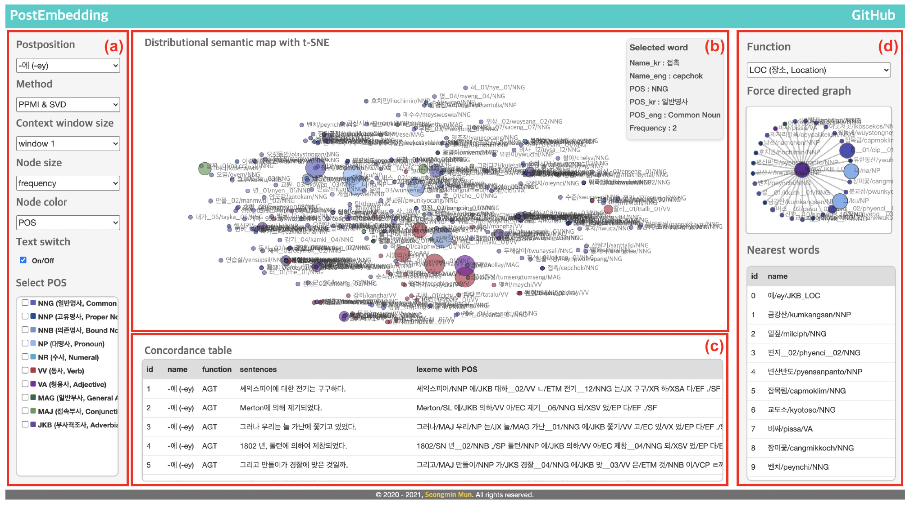

# PostEmbedding

<!--      -->
     

## Abstract
PostEmbedding is a visualization system to see the relationships between Korean postpositions and co-occurring words.

### Screenshots
-----------

  

- [Try to use PostEmbedding](https://seongmin-mun.github.io/VisualSystem/Major/PostEmbedding/index.html)

## Description
The figure shows the overall composition of the developed visualization system. (a) provides menus to select the postpositions, the models, and the window sizes to check word-level embeddings results. It also allows users to adjust the color and size of the circle representing each word, to turn on and off the text above the circle, and to highlight the circle according to the selected parts of speeches. (b) shows a distributional semantic map of the word-level embeddings reduced to two dimensions using t-SNE. (c) shows the hand-coded corpus actually used in the selected postposition for each function. (d) allows users to choose particular functions of the postpositions and check the information about surrounding words relative to the function. The developed system shows changes of the relationship between one word and the co-occurring words using the changes of clusters that are generated by combinations of these words.

### Skills
-------
Machine Learning & NLP & Statistics

- Computer Languages: Java, R, Python
- DataBase: MySQL, MongoDB
- Machine Learning: Word-Embedding (Singular Value Decomposition, Positive Pointwise Mutual Information), t-SNE (t-Distributed Stochastic Neighbor Embedding)
- NLP-based methods: Dependency tagger, POS tagger, Pre-Processing (tokenization, lemmatization, N-gram, window size), etc.
- Statistics: Principal Component Analysis, Independence t-test, Correlation
- Tools: IntelliJ IDEA, RStudio, PyCharm, bitnami

Visualization Technique

- Visualization Method: Force directed graph, Distributional semantic map

Server (Back-end)

- Computer Languages: Java, Python, PHP
- DataBase: MySQL, MongoDB
- Libraries: Java (KKMA(org.snu.ids.ha), Eunjeon (org.bitbucket.eunjeon.seunjeon)), Python (numpy, sklearn, pandas, nltk, gensim, scipy)
- Tools: IntelliJ IDEA, PyCharm

Client (Front-end)

- Computer Languages: javascript (d3.js, jquery.js), html/css
- DataBase: json
- Tools: Atom, WebStorm

