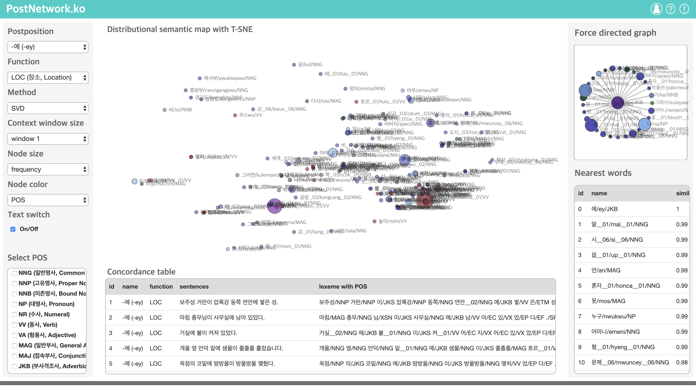

# PostNetwork.ko

<!--      -->
      

## Abstract
- d3.js적용
- bootstrap 적용
- 각 종 라이브러리 적용
- 시각화를 위한 인터페이스 생성
- 왼쪽 의미기능 선택 활성화
- 조사 선택에 따라 의미기능 옵션 변환하기
- 버튼 작동 여부 체크 
- 세션 하단에 문장 데이터 추가
- 의미 분포 맵 시각화 생성
- 네트워크 시각화 생성
- 옵션 선택에 따른 변경 적용
- 텍스트 on/off 스위치 추가
- 노드, 텍스트 사이즈 수정
- 반응형 웹으로 사이즈 설정

### Screenshots
-----------

  </img>

### Skills
-------
Machine Learning & NLP

- Language : R, Python
- DataBase : MySQL
- Machine Learning : PPMI (Positive Pointwise Mutual Information), SVD (Singular Value Decomposition), SGNS (Skip-Gram with Negative Sampling), TSNE (t-Distributed Stochastic Neighbor Embedding)
- NLP : Morpheme analysis, Pre-Processing (tokenization, lemetazation, N-gram, window size) etc.
- Tool : RStudio, PyCharm, Jupyter notebook

Visual Technique

- Visual Method : Distribution Map, Force Directed Network

Server (Back-end)

- Language : Java, Python, PHP
- DataBase : MySQL
- Library : Java (KKMA(org.snu.ids.ha), Eunjeon (org.bitbucket.eunjeon.seunjeon)), Python (numpy, sklearn, pandas, nltk, gensim, scipy)
- Tool : IntelliJ IDEA, PyCharm

Client (Front-end)

- Language : javascript (d3.js, jquery.js, bootstrap.js), html/css
- DataBase : json
- Tool : Atom, WebStorm
