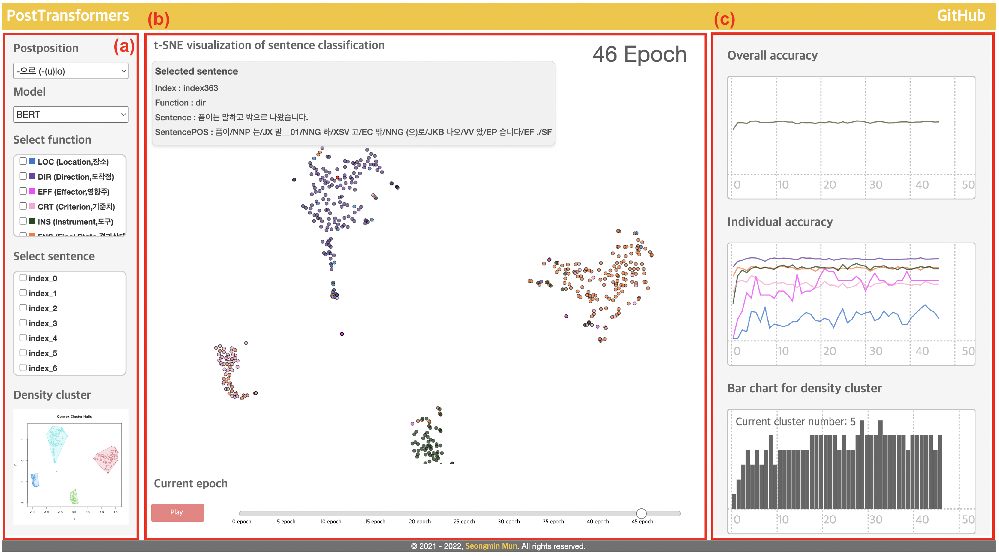

# PostTransformers
<!--[](https://shields.io/#/) [](https://shields.io/#/) [](https://shields.io/#/) [](https://shields.io/#/) [](https://shields.io/#/) [](https://shields.io/#/) [](https://shields.io/#/)-->
[](https://shields.io/#/) [](https://shields.io/#/) [](https://shields.io/#/) [](https://shields.io/#/) [](https://shields.io/#/) [](https://shields.io/#/)

## Abstract
Postpositions, which are characterized as multiple form-function associations and thus polysemous, pose a challenge to automatic identification of their usage. Several studies have used contextualized word-embedding models to reveal the functions of Korean postpositions. Despite the superior classification performance of previous studies, the particular reason how these models resolve the polysemy of Korean postpositions is not enough clear. To add more interpretation, for this reason, we devised a classification model by employing two transformer-architecture modelss—BERT and GPT-2s—and introduces a computational simulation that interactively demonstrates how these transformer-architecture models simulate human interpretation of word-level polysemy involving Korean adverbial postpositions -ey, -eyse, and -(u)lo. Results reveal that (i) the BERT model performs better than the GPT-2 model to classify the intended function of postpositions, (ii) there is an inverse relationship between the classification performance and the number of functions that each postposition manifests, (iii) model performance is affected by the corpus size of each function, (iv) the models' performance gradually improves as the epoch proceeds, and (vi) the models are affected by the scarcity of input and/or semantic closeness between the items.

## Developing BERT and GPT-2 models
In the <strong>pythonCode</strong> folder, there is an entire code for model training.

## Developing the visualization system
The figure shows the interface of the developed visualization system. (a) provides options to select the postpositions or models and checkboxes to highlight and tracking interesting sentences according to the index number or the function of these postpositions. (b) shows a distributional map of the sentence-level embeddings reduced to two dimensions using t-SNE. It also allows users to see the details of each sentence (represented as points) when the users hover their cursor over the circle. This allows the user to check the information such as an index number of the selected sentence, the intended function of the postpositions used in the sentence, and the raw sentence. At the bottom of (b), there is a play button to see the changes of the model outcome in each epoch. (c) shows two different types of model information: (a) multi-line charts for its performance and (b) a bar chart for density cluster. The multi-line charts on the right side of the visualization system (see (c)) allow users to see the model performance such as overall accuracy and by-function accuracy in relation to the classification task by epoch (i.e., learning). This view also provides a hovering function to see the detailed F-score of each line in each epoch. The bar chart at the bottom of the right side of the visualization system (see (c)) is to present the number of clusters indicating how transformer model classified the sentences by their function in each epoch. This bar chart also provides a hovering function to see the actual number of clusters in each epoch.

### Screenshots
-----------
<div>
  <a target="_blank" rel="noopener noreferrer" href="https://seongmin-mun.github.io/VisualSystem/Major/PostTransformers/index.html"></a>
</div>

- [Try to use PostTransformers](https://seongmin-mun.github.io/VisualSystem/Major/PostTransformers/index.html)

### Skills
-------
Machine Learning & NLP & Statistics

- Computer Languages: Java, R, Python
- DataBase: MySQL
- Machine Learning: Sentence-Embedding (Bidirectional Encoder Representations from Transformers), t-SNE (t-Distributed Stochastic Neighbor Embedding)
- NLP-based methods: Dependency tagger, POS tagger, Pre-Processing (tokenization, lemmatization, N-gram, window size), etc.
- Statistics: Density-based clustering, Independence t-test, Correlation
- Tools: IntelliJ IDEA, RStudio, PyCharm, bitnami

Visualization Technique

- Visualization Method: Force directed graph, Distributional semantic map, Multi-line chart

Server (Back-end)

- Computer Languages: Java, Python, PHP
- DataBase: MySQL
- Libraries: Java (KKMA(org.snu.ids.ha), Eunjeon (org.bitbucket.eunjeon.seunjeon), Python (numpy, sklearn, pandas, nltk, gensim, scipy)
- Tools: IntelliJ IDEA, PyCharm

Client (Front-end)

- Computer Languages: javascript (d3.js, jquery.js), html/css
- DataBase: json
- Tools: Atom, WebStorm

### Reference
-----------
If you use our code or visualization system for research, please cite:
```
@inproceedings{mun-desagulier-2022-transformer,
    title = "How do transformer-architecture models address polysemy of Korean adverbial postpositions?",
    author = "Mun, Seongmin  and
      Desagulier, Guillaume",
    booktitle = "Proceedings of Deep Learning Inside Out (DeeLIO): The 3rd Workshop on Knowledge Extraction and Integration for Deep Learning Architectures",
    month = may,
    year = "2022",
    address = "Dublin, Ireland",
    publisher = "Association for Computational Linguistics",
    pages = "1--11",
    abstract = "Postpositions, which are characterized as multiple form-function associations and thus polysemous, pose a challenge to automatic identification of their usage. Several studies have used contextualized word-embedding models to reveal the functions of Korean postpositions. Despite the superior classification performance of previous studies, the particular reason how these models resolve the polysemy of Korean postpositions is not enough clear. To add more interpretation, for this reason, we devised a classification model by employing two transformer-architecture modelss—BERT and GPT-2s—and introduces a computational simulation that interactively demonstrates how these transformer-architecture models simulate human interpretation of word-level polysemy involving Korean adverbial postpositions -ey, -eyse, and -(u)lo. Results reveal that (i) the BERT model performs better than the GPT-2 model to classify the intended function of postpositions, (ii) there is an inverse relationship between the classification performance and the number of functions that each postposition manifests, (iii) model performance is affected by the corpus size of each function, (iv) the models' performance gradually improves as the epoch proceeds, and (vi) the models are affected by the scarcity of input and/or semantic closeness between the items.",
}
```
