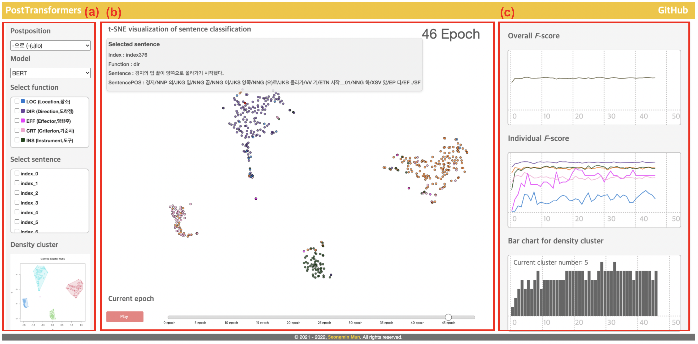

# PostTransformers

<!--      -->
     

## Abstract
PostTransformers was made to simulate how the transformer models interprets the polysemy of words involving Korean postpositions by each epoch.

### Screenshots
-----------

  

- [Try to use PostTransformers](https://seongmin-mun.github.io/VisualSystem/Major/PostTransformers/index.html)

## Description
The figure shows the interface of the developed visualization system. (a) provides options to select the postpositions or models and checkboxes to highlight and tracking interesting sentences according to the index number or the function of these postpositions. (b) shows a distributional map of the sentence-level embeddings reduced to two dimensions using t-SNE. It also allows users to see the details of each sentence (represented as points) when the users hover their cursor over the circle. This allows the user to check the information such as an index number of the selected sentence, the intended function of the postpositions used in the sentence, and the raw sentence. At the bottom of (b), there is a play button to see the changes of the model outcome in each epoch. (c) shows two different types of model information: (a) multi-line charts for its performance and (b) a bar chart for density cluster. The multi-line charts on the right side of the visualization system (see (c)) allow users to see the model performance such as overall accuracy and by-function accuracy in relation to the classification task by epoch (i.e., learning). This view also provides a hovering function to see the detailed score of each line in each epoch. The bar chart at the bottom of the right side of the visualization system (see (c)) is to present the number of clusters indicating how transformer model classified the sentences by their function in each epoch. This bar chart also provides a hovering function to see the actual number of clusters in each epoch.

### Skills
-------
Machine Learning & NLP & Statistics

- Computer Languages: Java, R, Python
- DataBase: MySQL
- Machine Learning: Sentence-Embedding (Bidirectional Encoder Representations from Transformers), t-SNE (t-Distributed Stochastic Neighbor Embedding)
- NLP-based methods: Dependency tagger, POS tagger, Pre-Processing (tokenization, lemmatization, N-gram, window size), etc.
- Statistics: Density-based clustering, Independence t-test, Correlation
- Tools: IntelliJ IDEA, RStudio, PyCharm, bitnami

Visualization Technique

- Visualization Method: Force directed graph, Distributional semantic map, Multi-line chart

Server (Back-end)

- Computer Languages: Java, Python, PHP
- DataBase: MySQL
- Libraries: Java (KKMA(org.snu.ids.ha), Eunjeon (org.bitbucket.eunjeon.seunjeon), Python (numpy, sklearn, pandas, nltk, gensim, scipy)
- Tools: IntelliJ IDEA, PyCharm

Client (Front-end)

- Computer Languages: javascript (d3.js, jquery.js), html/css
- DataBase: json
- Tools: Atom, WebStorm
