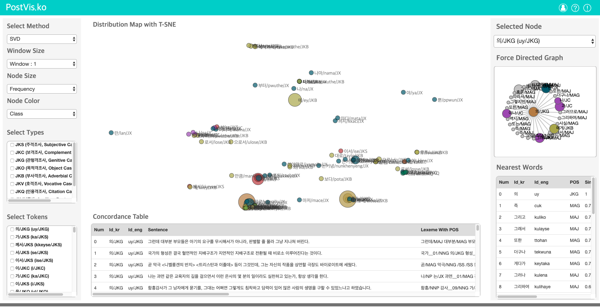

# PostVis.ko

    

## Content
Korean is a Subject-Object-Verb language, which has case marking by dedicated postpositions (Sohn, 1999). In this research project, I investigate polysemy of postpositions in Korean under the framework of Construction Grammar (Goldberg, 1995), A postposition is defind as a function word indicating grammatical information to which they are attached (Sohn, 1999). As a form-function pairing, a postposition can be polysemous in that one form delivers mutiple functions (Glynn D., 2014). I pose key questions as to the nature of polysemy involving postpositions and the identification of polysemous postpositions. The meaning of a word in a sentence can be predicted by the relation to the co-occurring words (dubbed the Distributional Hypothesis; McDonald & Ramscar, 2001). It is thus assumed that we can identify the polysemy of a word based on information obtained from surrounding words. This account has been implemented by way of NLP methods (Hilpert 2016, Desagulier 2014). In this project, I use several NLP methods for the analysis of the Korean corpora in other to reveal the nature of polysemy involving postpositions in Korean. Currently, I explore the suitable NLP method which yields the best performance for this work by developing a system that visualize the results in accordance to the various NLP methodologies.

### Screenshots
-----------

  </img>

- [Try to use PostVis.Ko](https://seongmin-mun.github.io/VisualSystem/Major/PostVis/index.html)

### Skills
-------
Server(Back-end)

- Language : Java, Python
- DataBase : MySQL
- Library : Java(KKMA(org.snu.ids.ha), Eunjeon(org.bitbucket.eunjeon.seunjeon)), Python(numpy, sklearn, pandas, nltk, gensim, scipy)
- Tool : IntelliJ IDEA, PyCharm

Client(Front-end)

- Language : html, javascript(d3.js, jquery.js), css
- DataBase : json
