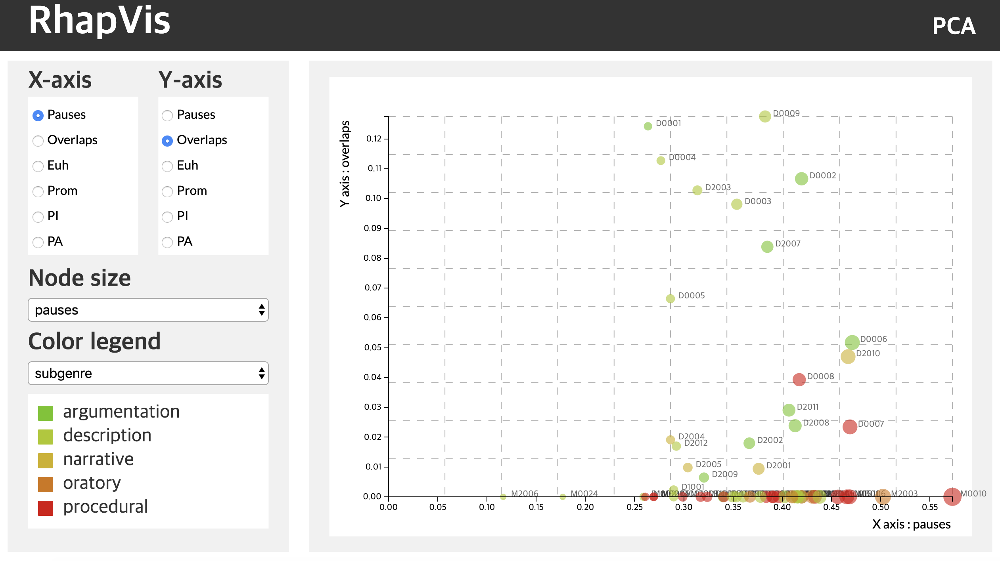

# RhapVis

<!--      -->
   

## Abstract
Rhapsodie is a 33000-word treebank of spoken French that is annotated for syntax and prosody. It breaks down into 57 five-minute long samples produced by 89 male and female speakers. en found in the previous studies. Through this study we verified final prediction model and suggested analysis method extract variety of information from the data. Our main research question is whether discourse types in French can be characterized and ultimately predicted by prosodic features. Our exploration shows that argumentative and narrative sequences are prosodically marked, whereas descriptive and procedural sequences are not. A discourse genre is prosodically marked when it is characterized by a high frequency of prosodic features, namely the simultaneous occurrence of overlaps, prominences, and intonation packages. We also claim that a discourse genre is prosodically marked when it is atypical with respect to the other speech genres.

### Screenshots
-----------

  </img>

- [Try to use RhapVis](https://seongmin-mun.github.io/VisualSystem/Major/RhapVis/index.html)

### Skills
-------
 Machine Learning & Statistics

- Language : R, Python
- DataBase : MySQL
- Machine Learning : PCA (Principal Component Analysis)
- Statistics : ANOVA (ANalysis Of VAriance)
- Tool : RStudio, PyCharm, Jupyter notebook

Visual Technique

- Visual Method : Two-dimensional plot, PCA

Server (Back-end)

- Language : R, Python
- DataBase : Rds
- Library : Python (numpy, pandas)
- Tool : RStudio, PyCharm

Client (Front-end)

- Language : javascript (d3.js, jquery.js), html/css
- DataBase : json
- Tool : Atom, WebStorm

### Related works
-------
Paper

- G. Desagulier, A. Lacheret-Dujour, F. Isel, and <strong>S. Mun</strong>, <i>Characterizing discourse genres with prosodic features in a reference treebank of spoken French</i>, Aflicojet2018, Corpora and Representativeness, Nanterre ,France, 3-4 May 2018, [PDF](http://localhost:8080/Web/MyWebsite-master/Seongmin/Resources/3.Conferences/Invitedtalks/AFLiCoJET2018/Characterizing%20discourse%20genres%20with%20prosodic%20features%20in%20a%20reference%20treebank%20of%20spoken%20French.pdf)

Video

- [Video](https://youtu.be/iizuzH-AIV4)

