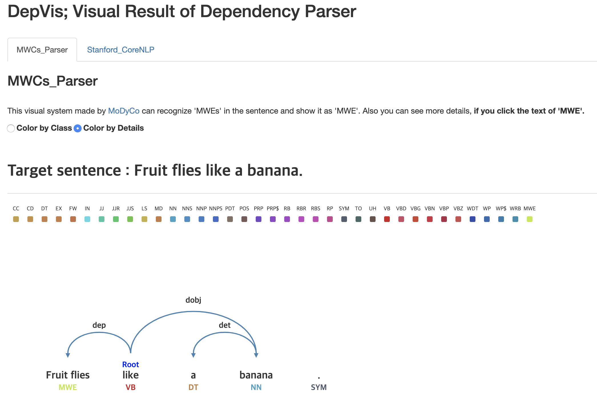

# DepVis

<!--      -->
    

## Abstract
Word can be divided into two types: those whose meaning can be described in one word and those whose meaning in expressed through a recurring combination of words, also known as multiword expressions (MWEs). These MWEs create problems in many language recognition systems (Stanford CoreNLP, Google Translator, etc.) because they are difficult to accurately recognize. Through this visualization, we compared the accuracy of algorithms that recognize MWEs with those that do not recognize MWEs.

### Screenshots
-----------

  </img>

- [Try to use DepVis](https://seongmin-mun.github.io/VisualSystem/Minor/DepVis/index.html)

### Skills
-------
 Machine Learning & NLP

- Language : Java, Python
- DataBase : MySQL
- Machine Learning : RNN (Recurrent Neural Network) 
- NLP : Morpheme analysis, Pre-Processing (tokenization, lemetazation, N-gram, window size), etc.
- Tool : IntelliJ IDEA, PyCharm, Jupyter notebook

Visual Technique

- Visual Method : Dependency visualization

Server (Back-end)

- Language : Java, Python
- DataBase : MySQL, MongoDB
- Library : Java (Stanford CoreNLP), Python (numpy, pandas)
- Tool : IntelliJ IDEA, PyCharm

Client (Front-end)

- Language : javascript (d3.js, jquery.js), html/css
- DataBase : json
- Tool : Atom, WebStorm

### Related works
-------
Paper

- [Try to use BubbleJoseon](https://seongmin-mun.github.io/VisualSystem/Major/BubbleJoseon/index.html)

Video

- [Try to use BubbleJoseon](https://seongmin-mun.github.io/VisualSystem/Major/BubbleJoseon/index.html)

