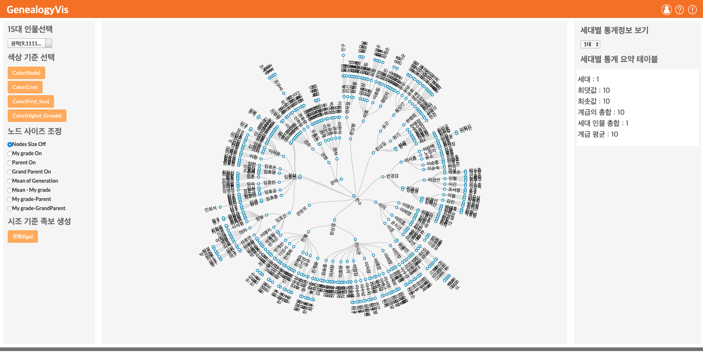

# GenealogyVis

<!--      -->
    

## Abstract
This study present a way to create visual system to analyze Genealogy of the Kwon family based on collaboration with historians. For the analysis, we used the radial tree visualization method, which expresses the relationship of people in the Kwon family.

### Screenshots
-----------

  </img>

- [Try to use GenealogyVis](https://seongmin-mun.github.io/VisualSystem/Minor/GenealogyVis/)

### Skills
-------
NLP

- Language : Java, Python
- DataBase : MySQL
- NLP : Morpheme analysis, Pre-Processing (tokenization, lemetazation, N-gram, window size), etc.
- Tool : IntelliJ IDEA, PyCharm, Jupyter notebook

Visual Technique

- Visual Method : Radial Tree

Server (Back-end)

- Language : Java, Python
- DataBase : MySQL, MongoDB
- Library : Java (Stanford CoreNLP), Python (numpy, pandas)
- Tool : IntelliJ IDEA, PyCharm

Client (Front-end)

- Language : javascript (d3.js, jquery.js), html/css
- DataBase : json
- Tool : Atom, WebStorm

