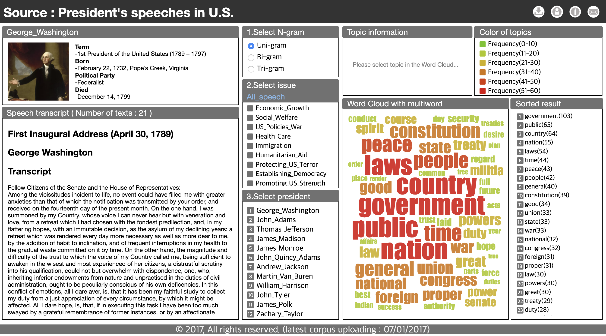

# MultiwordVis

<!--      -->
   

## Abstract
Topics in a text corpus include features and information; visualizing these topics can improve a user’s understanding of the corpus. Topics can be broadly divided into two categories: those whose meaning can be described in one word and those whose meaning is expressed through a combination of words. The latter type can be described as multiword expressions and consists of a combination of different words. However, the analysis of multiword topics requires systematic analysis to extract accurate topic results. Therefore, we propose a visual system that accurately extracts topic results with multiple word combinations. For this study, we utilize the text of 957 speeches from 43 U.S. presidents (from George Washington to Barack Obama) as corpus data. Our visual system is divided into two parts: First, our system refines the database by topic, including multiword topics. Through data processing, we systematically analyze the accurate extraction of multiword topics. In the second part, users can confirm the details of this result with a word cloud and simultaneously verify the result with the raw corpus. These two parts are synchronized and the desired value of N in the N-gram model, topics, and presidents examined can be altered. In this case study of U.S. presidential speech data, we verify the effectiveness and usability of our system.

### Screenshots
-----------

  </img>

- [Try to use MultiwordVis](https://seongmin-mun.github.io/VisualSystem/Minor/MultiwordVis/index.html)

### Skills
-------
Machine Learning & NLP

- Computer Languages: Java, Python
- DataBase: MySQL, MongoDB
- Machine Learning: RNN (Recurrent Neural Network)
- NLP-based methods: Dependency tagger, POS tagger, Pre-Processing (tokenization, lemmatization, N-gram, window size), etc.
- Tools: IntelliJ IDEA, PyCharm, Jupyter notebook

Visualization Technique

- Visualization Method: Word Cloud

Server (Back-end)

- Computer Languages: Java, Python
- DataBase: MySQL, MongoDB
- Libraries: Java (Stanford CoreNLP), Python (numpy, pandas)
- Tools: IntelliJ IDEA, PyCharm

Client (Front-end)

- Computer Languages: javascript (d3.js, jquery.js), html/css
- DataBase: json
- Tools: Atom, WebStorm

