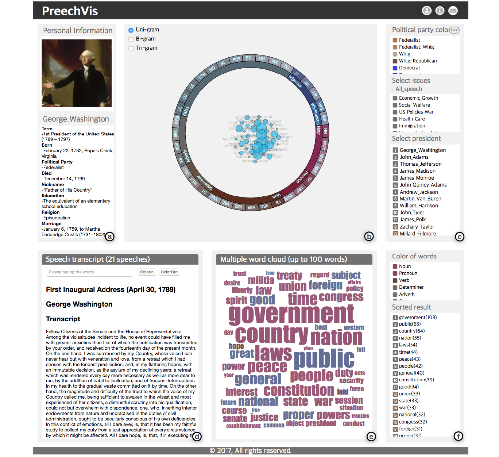

# PreechVis

<!--      -->
   

## Abstract
Word can be divided into two types: those whose meaning can be described in one word and those whose meaning is expressed through a recurring combination of words, also known as multiword expressions (MWEs). An interactive visualization can be useful for analyzing multiword expressions because the following features are of interest to linguistics scholars: (1) Showing the combinatory POS pattern of a hierarchical form, (2) exploring results according to the POS pattern, and (3) searching the source corpus for the analysis-result verification. Therefore, we propose PreechVis, an interactive-visualization tool that includes all of the requisite functions for an analysis for which multiple words are utilized. For the present study, we used a total of 957 speeches of 43 U.S. Presidents from George Washington to Barack Obama as the corpus data. In the experiments and case studies on the U.S.-President speech data, we verified the effectiveness and usability of PreechVis.

### Screenshots
-----------

  

- [Try to use PreechVis](https://seongmin-mun.github.io/VisualSystem/Minor/PreechVis/index.html)

### Skills
-------
Machine Learning & NLP

- Computer Languages: Java, Python, R
- DataBase: MySQL
- Machine Learning: RNN (Recurrent Neural Network)
- NLP-based methods: TF-IDF, POS tagger, Pre-Processing (tokenization, lemmatization, N-gram, window size), etc.
- Tools: IntelliJ IDEA, PyCharm, Jupyter notebook, RStudio

Visualization Technique

- Visualization Methods: Sunburst, Wordcloud, RadVis

Server (Back-end)

- Computer Languages: Java, Python
- DataBase: MySQL, MongoDB
- Libraries: Java (Stanford CoreNLP), Python (numpy, pandas)
- Tools: IntelliJ IDEA, PyCharm

Client (Front-end)

- Computer Languages: javascript (d3.js, jquery.js), html/css
- DataBase: json
- Tools: Atom, WebStorm

