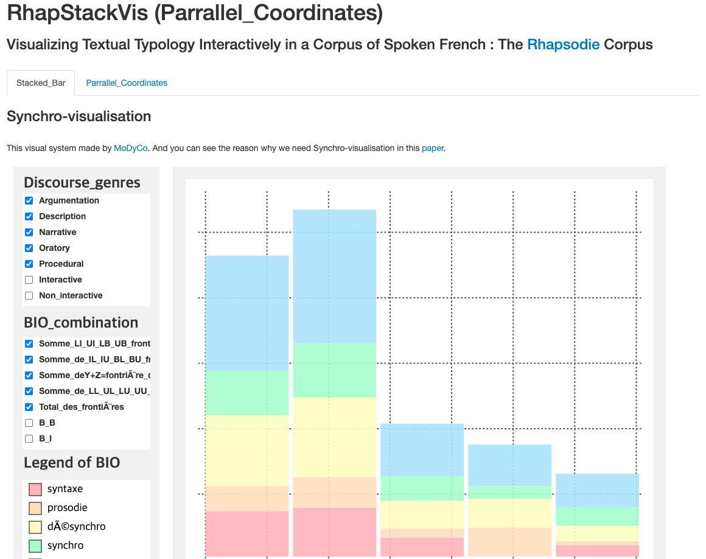

# RhapStackVis

<!--      -->
   

## Abstract
Rhapsodie is a 33000-word treebank of spoken French that is annotated for syntax and prosody. It breaks down into 57 five-minute-long samples produced by 89 male and female speakers. The discourse profile of each sample is captured by six variables: event structure (dialogue vs. monologue), social context (public vs. private), genre (argumentation, description, narrative, oratory, and procedural), interactivity (interactive, non-interactive, and semi-interactive), channel (broadcasting and face-to-face), and planning type (planned, semi-spontaneous, and spontaneous). This visualization uses Stacked Bar Chart and Parallel coordinates to help users select and analyze the variables and legends they want.

### Screenshots
-----------

  

- [Try to use RhapStackVis](https://seongmin-mun.github.io/VisualSystem/Minor/RhapStackVis/index.html)

### Skills
-------
Visualization Technique

- Visualization Method: Stacked Bar Chart, Parallel coordinates

Server (Back-end)

- Computer Languages: Python
- DataBase: MySQL
- Libraries: Python (numpy, pandas)
- Tools: PyCharm

Client (Front-end)

- Computer Languages: javascript (d3.js, jquery.js), html/css
- DataBase: json
- Tools: Atom, WebStorm
